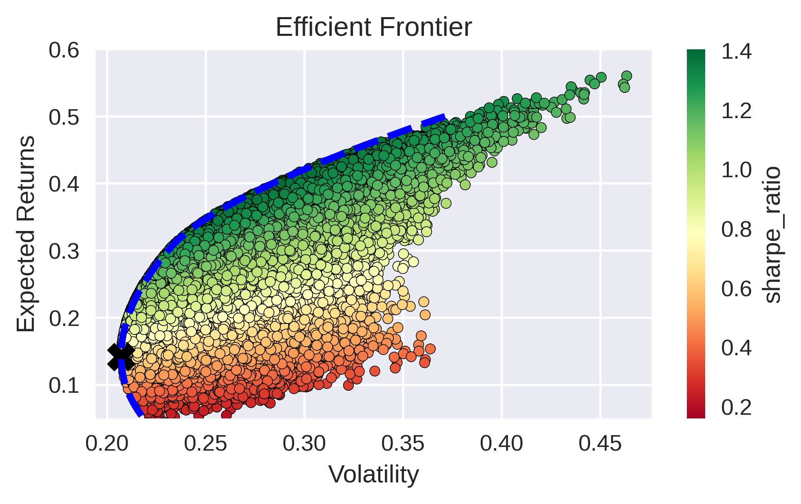

# Paolo's Portfolio optmization 

Personal repository where I investigate, using math and statistics, which portfolio could be the optimal for my long term goal.

## Notebooks

The notebook are based on the current knowledge that I have and thefore I'm going to evaluate the following methods:

- Linear and non linear optmization
    - [Minimum variance portofolio (Danish stocks)](Linear%20and%20non%20Linear%20Opt\min_var_danish.ipynb)
    - [Maximum sharpe ratio portfolio (Danish stocks)](Linear%20and%20non%20Linear%20Opt\max_sr_danish.ipynb)
- Stochastich optimizaition
- Reinforcement learning approach

## Constrains

- I perfer to buy Nordics stocks since I'm based in denmark an my broker doesn't charge a lot of fees for nordics stocks. Commissions on Nordic stocks is the 0.10% and the minimum that the bank is going to charge is 29 DKK (wich are approx 3.89€). For more info on the fees look at the following [link](https://www.nordea.dk/privat/produkter/investering/nordeainvestor.html#tab=Kurtage).

## TODOs

- [ ] EDA notebook
- [ ] Input preprocessing notebook
- [x] Refactor code in [min_var_danish](Linear and non Linear Opt\min_var_danish.ipynb) (**In progress**)
- [ ] Add min var portfolio with the transaction cost constraints
- [x] Read Risk and Asset Allocation for learning of to model the distribution of returns

